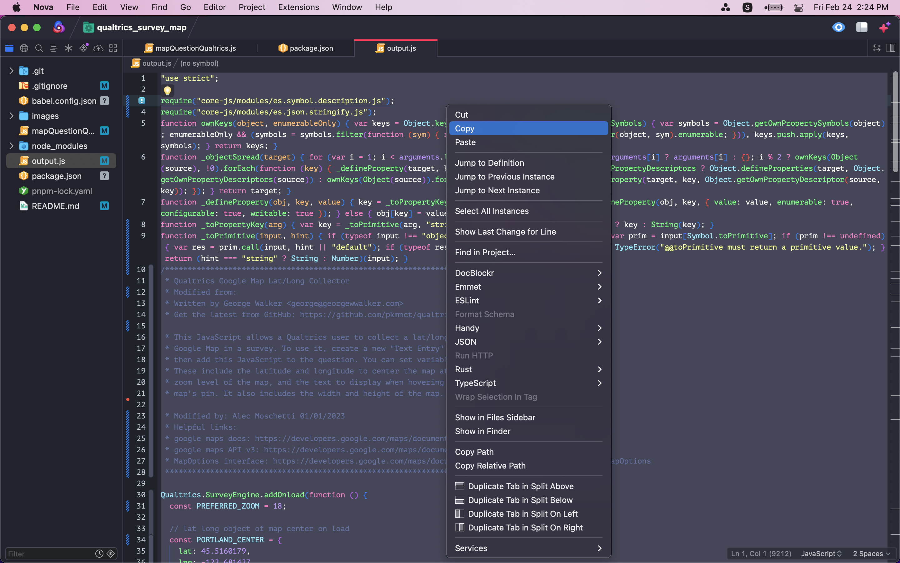
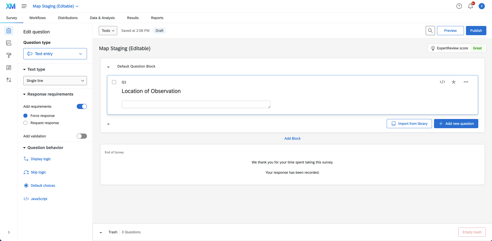
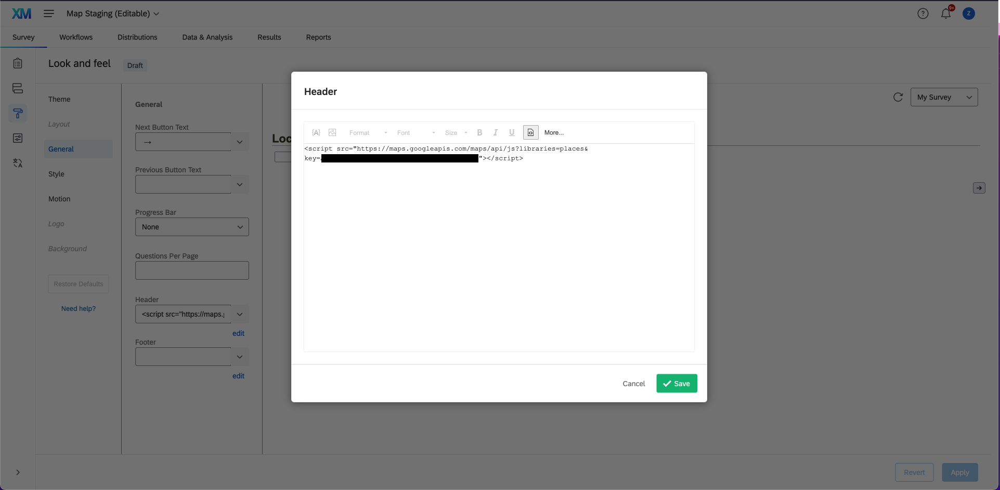
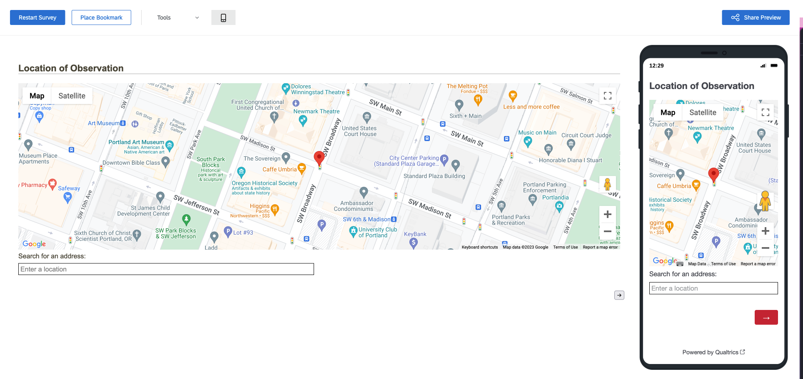

# Adding JS and a google map to a Qualtrics survey question

## What you'll need
- Qualtrics login for PUCP
- Google maps API key (>= GOOGLE MAPS API V3)
- Your preferred IDE

## Helpful links
- [Qualtrics API docs](https://api.qualtrics.com/48f1226327f89-overview)
- [Google maps docs](https://developers.google.com/maps/documentation/javascript/reference)
- [MapOptions interface](https://developers.google.com/maps/documentation/javascript/reference/map#MapOptions)
- [Babel docs](https://babeljs.io/docs/)

## Credit to George Walker and his GitHub repo
Upon researching how to implement this, we found this repo that offered a solution to the problem we were trying to solve.

All credit goes to George Walker and his repository which you can find here: [qualtrics-google-map-lat-long](https://github.com/pkmnct/qualtrics-google-map-lat-long)

## Step 1 - Get the code
Clone this repository and open the cloned directory in your editor of choice.

Use a node package manager to install the dependencies from the package.json.

> I used pnpm but npm should work perfectly fine:
- [pnpm docs](https://pnpm.io/motivation)
- [npm docs](https://docs.npmjs.com/)

## Step 2 - Implement your changes to mapQuestionQualtrics.js
All of the existing code lives inside a predefined qualtrics function called `addOnLoad`. This function gets called upon the initial survey page load. You can read more about the qualtrics javascript API [here](https://api.qualtrics.com/82bd4d5c331f1-qualtrics-java-script-question-api-class).

In the `initMap` function, we grab the DOM element and append a newly created div to hold our google map object. This is the place to add custom css styles and event listeners to update the position of the map markers and call our defined function `setLatLng` to update the value of the data box that holds the user input.

If the existing logic needs to be modified, or if new logic needs to be added, it will most likely take place in one of the event listeners inside the `initMap` function.

You may change the map options or markers in the code block that invokes the `initMap` function since the map object argument is passed with an object literal.

### TODO:
There are a lot of opportunities to refactor this script.

## Step 3 - Compile with Babel
The only development dependency this repo uses is Babel, which is used to compile our JavaScript to ensure it will behave with Qualtrics scripts.

If you have never used Babel, you may read the getting started docs here [babel usage](https://babeljs.io/docs/usage).

You will notice that in the package.json file, I created a babel script to simply run `pnpm run babel` from the command line to shorthand run this command `./node_modules/.bin/babel mapQuestionQualtrics.js -o output.js`.

The resulting compilation should replace the existing contents of output.js. This is the code to copy and paste into the survey question on Qualtrics.

It might look something like this:



## Step 4 - Updating Qualtrics
In the logged in Qualtrics homepage, select the Survey tab from the nav menu (default selection). Make sure the question you are editing is the Map Staging (Editable) survey which is created just for development.

Select the builder icon to edit the survey question(s) (default selection).

Ensure that the question type value is `Text entry` and the text type value is `Single line`.

So far you should see something like this:



Either click the </> JavaScript icon in the question behavior sidebar, or click the </> icon inside the question. A text editor will appear for you to paste the resulting output.js code into.

Ensure that the html header that Qualtrics is using has a valid google maps script and API key. You'll have to click on the Look and Feel icon (painter's brush) in the sidebar under the Survey tab. Following that you'll click on the General tab in the new sidebar that pops up.

You should now see a list of text fields with drop down arrows, edit the one that says **Header**.

In the text editor that popped up, click the <> icon from the toolbar.
Paste in the google maps API script tag which should look something like this:

```
<script src="https://maps.googleapis.com/maps/api/js?libraries=places&key=[your-super-secret-key-here-no-brackets]"></script>
```

Make sure to **never** post your API keys anywhere the public will see. **Bad things will happen!**

Here is what this page and process looks like currently:



## Step 5 - Preview your changes

Preview the survey to make sure the map is looking and behaving as expected. Let Zuriel (or current project manager) know that the map is ready for review.

If all is well, you're preview page should look like this:



## Troubleshooting

### There are a bunch of warning messages
Yeah. Seems to be Qualtrics related but I'm not positive. This is a TODO list task to look into.

### ??? Your new problem here
